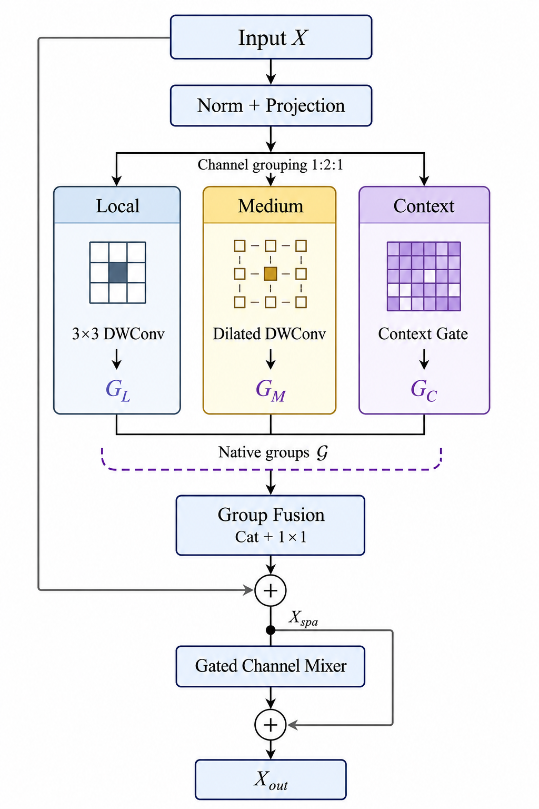

# HazeGroupNet

Official PyTorch implementation of **HazeGroupNet: Dual-Cue Residual
Calibration for Native Receptive-Field Groups in Remote Sensing Image
Dehazing**.

HazeGroupNet is a compact encoder--decoder for remote-sensing image
dehazing. Its Tri-Receptive Block (TRB) preserves local, medium-range, and
contextual operator responses as *native groups* before shared fusion. The
Dual-Cue Group Residual Calibration (DGRC) module then uses an input-derived
haze cue and decoder-conditioned group discrepancies to produce a
prior-centered residual correction, while retaining ordinary additive skip
fusion as the main information path.

<p align="center">
  
</p>

> **Release scope.** This repository contains source code, configurations,
> split-manifest specifications, frozen-evaluation instructions, and a curated
> representative-checkpoint set. The checkpoint release is being populated as
> a six-model matrix (RRSHID/SateHaze1k x Tiny/Small/Large); its authoritative
> current status is recorded in [`checkpoints/MANIFEST.json`](checkpoints/MANIFEST.json).
> Datasets and third-party baseline implementations are not redistributed.

## Highlights

- Tri-Receptive Blocks with local, medium-range, and contextual branches.
- A native-group interface that retains post-operator, pre-fusion responses.
- Dual-cue, prior-centered residual calibration that has an exact additive
  fusion neutral state.
- Tiny, Small, and Large configurations for accuracy--cost studies.
- Generic paired-image training, evaluation, inference, and profiling entry
  points.

## Tri-Receptive Block

The final encoder TRB at every skip-connected scale propagates its fused
output and separately retains the operator-defined native groups consumed by
DGRC. These groups are not recovered by splitting an already fused feature.

<p align="center">
  
</p>

## Repository layout

```text
HazeGroupNet/
|-- assets/                  # Architecture figures used in this README
|-- checkpoints/             # Representative validation-selected weights
|-- configs/                 # RRSHID and SateHaze1k configurations
|-- docs/                    # Installation, data, reproducibility, notices
|-- reproducibility/paper/   # Paper protocol and reported-result metadata
|-- src/hazegroupnet/        # Model, data, metric, and utility source code
|-- tests/                   # Unit and smoke tests
`-- tools/                   # Training, evaluation, inference, profiling CLIs
```

## Installation

Create a Python environment with PyTorch compatible with your CUDA runtime,
then install the project in editable mode:

```bash
git clone https://github.com/jxy0413/HazeGroupNet.git
cd HazeGroupNet
pip install -e .
```

See [docs/INSTALL.md](docs/INSTALL.md) for a tested dependency outline.

## Data preparation

Datasets are not redistributed. Prepare paired hazy/clean images and a CSV
manifest whose paths are relative to `--dataset-root`:

```csv
image_id,hazy_path,gt_path,split,haze_level
sample_0001,hazy/sample_0001.png,clean/sample_0001.png,test,thick
```

The expected column semantics, public-dataset restrictions, and protocol
notes are in [docs/DATASETS.md](docs/DATASETS.md). The paper-manifest format
is documented in
[reproducibility/paper/manifests/README.md](reproducibility/paper/manifests/README.md).

## Quick start

The following commands use the public, path-agnostic CLIs. They accept either
one of the representative checkpoints in `checkpoints/` or a user-supplied
checkpoint.

```bash
# Train a Small model with a paired-image manifest.
python tools/train.py --config configs/rrshid/small.yaml \
  --dataset-root /path/to/RRSHID --train-manifest /path/to/train.csv \
  --val-manifest /path/to/val.csv --output-dir runs/rrshid_small

# Evaluate the released RRSHID Small checkpoint with saved-image 8-bit metrics.
python tools/evaluate.py --config configs/rrshid/small.yaml \
  --checkpoint checkpoints/RRSHID_HGN-S_best.pt --dataset-root /path/to/RRSHID \
  --manifest /path/to/test.csv --output-dir results/rrshid_small \
  --save-predictions

# Run inference on one image or a directory.
python tools/infer.py --config configs/rrshid/large.yaml \
  --checkpoint /path/to/checkpoint.pt --input /path/to/image_or_directory \
  --output outputs/

# Profile parameters and convolutional MACs at a chosen resolution.
python tools/profile.py --config configs/rrshid/small.yaml --height 256 --width 256
```

## Configurations

| Variant | Base width | Encoder TRBs | Bottleneck TRBs | Decoder TRBs |
|:--|--:|:--|--:|:--|
| Tiny | 16 | (2, 2, 3) | 4 | (3, 2, 2) |
| Small | 24 | (3, 3, 4) | 6 | (4, 3, 3) |
| Large | 32 | (4, 4, 6) | 8 | (6, 4, 4) |

The paper reports 0.545M/1.961G, 1.708M/5.806G, and 4.071M/13.597G
parameters/convolutional MACs for Tiny, Small, and Large, respectively,
under the stated profiling protocol. See
[reproducibility/paper/README.md](reproducibility/paper/README.md) before
comparing these values with measurements from another profiler.

## Reproducibility and reported results

The manuscript uses fixed data splits, checkpoint-selection rules, and a
frozen evaluation protocol. This release provides the protocol specification,
a generic evaluator, reported-result metadata, and one representative
validation-selected checkpoint for each dataset/variant as it becomes
available. The six representative weights are not an ensemble and do not by
themselves reproduce the manuscript's three-seed mean and sample SD.
The evaluator clips and quantizes every prediction to 8-bit sRGB before
computing metrics; `--save-predictions` writes the exact same arrays used by
the metric functions.
Please read
[docs/REPRODUCIBILITY.md](docs/REPRODUCIBILITY.md) and
[reproducibility/paper/expected_metrics.json](reproducibility/paper/expected_metrics.json)
before interpreting numerical differences.
The paper-value retention and saved-PNG consistency audit is recorded in
[reproducibility/paper/EVALUATION_8BIT_AUDIT.md](reproducibility/paper/EVALUATION_8BIT_AUDIT.md).
The full-precision per-image score files released for the revision are in
[reproducibility/paper/r44_score_provenance](reproducibility/paper/r44_score_provenance).

The RRSHID and SateHaze1k recipes also encode the paper's frozen
quality-based early-stopping rule. Monitoring begins only at the configured
anchor step, and training stops no earlier than the full five-validation
patience window.

## Citation

If this code is useful in your work, please cite the associated paper. A
machine-readable record is available in [CITATION.cff](CITATION.cff).

## Third-party and data notices

This repository does not redistribute RRSHID, SateHaze1k, RICE, or
comparative-method code. Representative HazeGroupNet checkpoints are described
in [`checkpoints/README.md`](checkpoints/README.md). See [NOTICE.md](NOTICE.md) and
[docs/THIRD_PARTY.md](docs/THIRD_PARTY.md) for attribution and usage notes.

## License

This project is released under the [MIT License](LICENSE).
